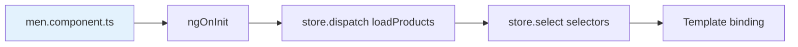
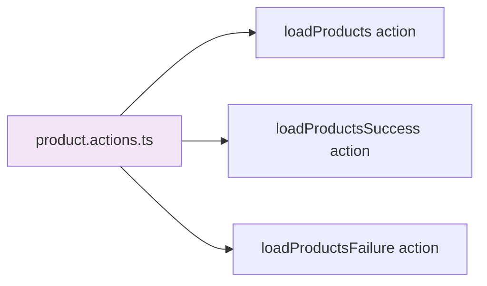
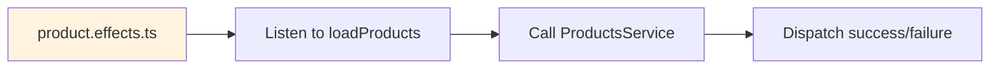
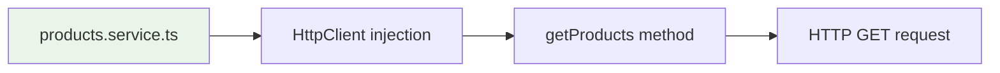
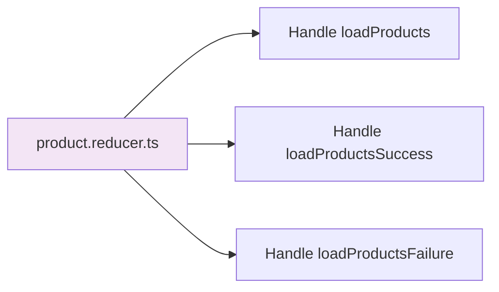
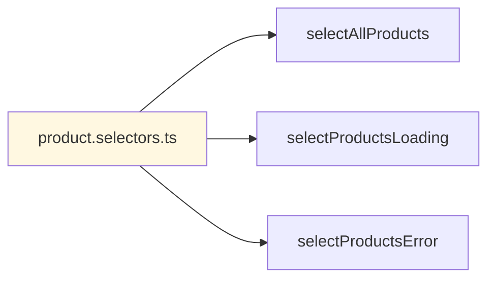
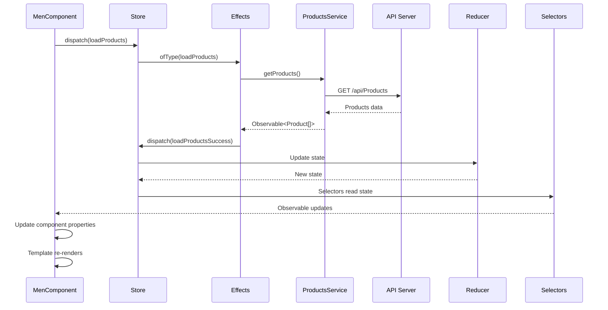
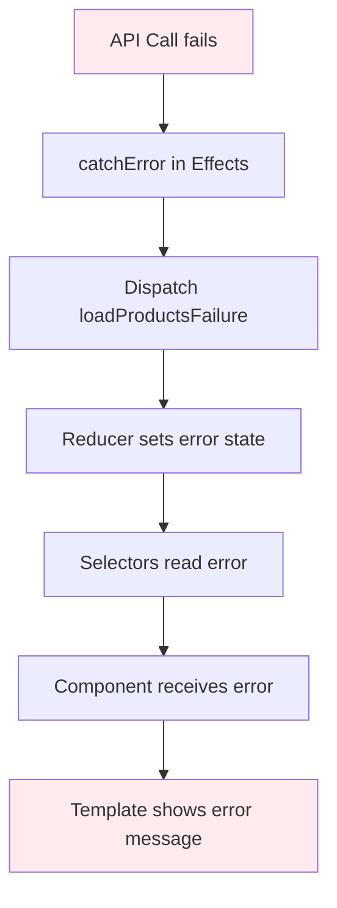
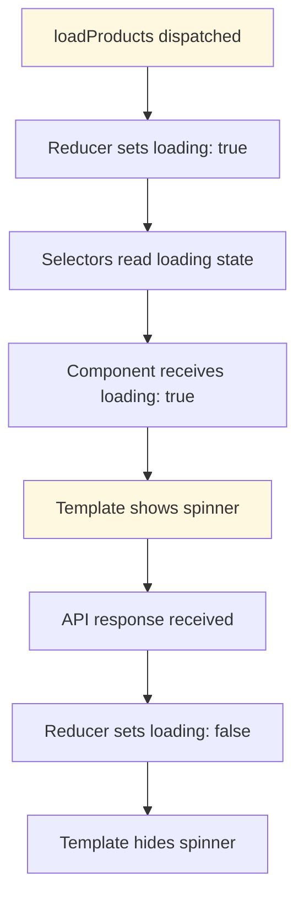
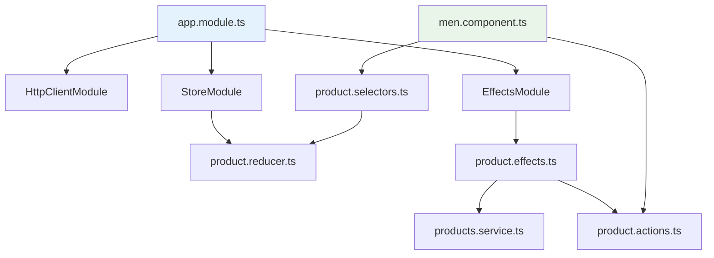

# Product API Flow - Complete Architecture

## Flowchart Overview

```mermaid
graph TD
    %% User Interaction
    A[User navigates to /men route] --> B[MenComponent loads]
    
    %% Component Initialization
    B --> C[ngOnInit executes]
    C --> D[Store.dispatch loadProducts action]
    
    %% NgRx Effects Layer
    D --> E[ProductEffects.loadProducts$ effect]
    E --> F[ofType loadProducts action]
    F --> G[mergeMap to ProductsService.getProducts]
    
    %% HTTP Service Layer
    G --> H[ProductsService.getProducts called]
    H --> I[HttpClient.get request]
    I --> J[GET https://localhost:7106/api/Products]
    
    %% API Response Handling
    J --> K{API Response}
    K -->|Success 200| L[Products data received]
    K -->|Error 4xx/5xx| M[HTTP Error thrown]
    
    %% Success Path
    L --> N[map operator transforms data]
    N --> O[Dispatch loadProductsSuccess action]
    O --> P[ProductReducer handles success]
    P --> Q[Update state: products[], loading: false, error: null]
    
    %% Error Path
    M --> R[catchError operator catches error]
    R --> S[Dispatch loadProductsFailure action]
    S --> T[ProductReducer handles failure]
    T --> U[Update state: loading: false, error: errorMessage]
    
    %% State Management
    Q --> V[Store state updated]
    U --> V
    
    %% Selectors Layer
    V --> W[Selectors read from store]
    W --> X[selectAllProducts selector]
    W --> Y[selectProductsLoading selector]
    W --> Z[selectProductsError selector]
    
    %% Component Data Binding
    X --> AA[MenComponent.products$ observable]
    Y --> BB[MenComponent.loading$ observable]
    Z --> CC[MenComponent.error$ observable]
    
    %% Component State Updates
    AA --> DD[products array updated]
    BB --> EE[loading boolean updated]
    CC --> FF[error object updated]
    
    %% Template Rendering
    DD --> GG[filteredProducts = [...products]]
    EE --> HH[Template shows/hides loading spinner]
    FF --> II[Template shows/hides error message]
    GG --> JJ[Template renders product cards]
    
    %% Final UI State
    HH --> KK[User sees loading state]
    II --> LL[User sees error state]
    JJ --> MM[User sees product grid]
    
    %% Styling
    style A fill:#e3f2fd
    style C fill:#e8f5e8
    style J fill:#fff3e0
    style V fill:#f3e5f5
    style MM fill:#e8f5e8
    style LL fill:#ffebee
    style KK fill:#fff8e1
```

## Detailed File-by-File Flow

### 1. Component Layer (Entry Point)


**Files:**
- `src/app/men/men.component.ts` - Triggers the flow
- `src/app/men/men.component.html` - Displays the results

### 2. NgRx Actions Layer


### 3. NgRx Effects Layer


### 4. Service Layer


### 5. State Management Layer


### 6. Selectors Layer


## Data Flow Sequence



## Error Handling Flow



## Loading State Flow



## Key Benefits of This Architecture

1. **Predictable State Changes**: All state changes go through actions and reducers
2. **Side Effect Management**: Effects handle async operations cleanly
3. **Reactive Updates**: Components automatically update when state changes
4. **Error Handling**: Centralized error handling through effects
5. **Loading States**: Built-in loading state management
6. **Testability**: Each layer can be tested independently
7. **Scalability**: Easy to add new features without breaking existing code

## File Dependencies



